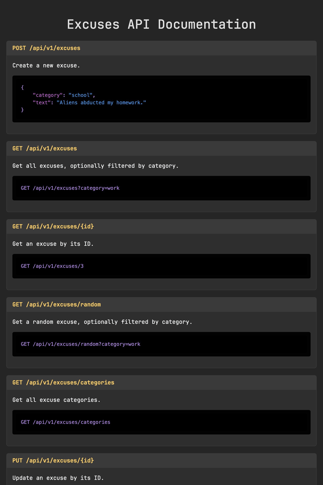

# Project Excuses

## The Excuses Repository

This API is an archive of excuses, ready to deploy at a moment's notice. Whether you need a reason to skip work,
escape a social gathering, or blame your pet for technological failures, we've got you covered.

The Excuse Repository starts with 18 classified excuses across the following categories:

- **Work**: "The spreadsheet corrupted itself."
- **School**: "My dog did, in fact, eat my homework."
- **Social**: "Lost in the time dilation of an afternoon nap."
- **Technology**: "Software update bricked everything."
- **Pets**: "My cat turned off the router."
- **General**: "Unforeseen quantum fluctuations."

New excuses can be forged, refined, and added to the archive, ensuring an ever-expanding database of plausible
deniability.

## Deployment & Infrastructure

### Project Structure

- `Excuses/` → ASP.NET Core Web API (Minimal API)
- `excuses-express-api/` → Express API

## Tech Stack

- **ASP.NET Core Web API**: Deployed as an Azure App Service, communicating with SQL Server (EF Core).
- **Express API**: A bridge between worlds, relaying requests to the ASP.NET API.
- **Both APIs**: Serve a sleek HTML-based documentation hub for easy excuse retrieval.

## Setup

### Excuse Repository Core (ASP.NET Web API)

Add your database connection string to `appsettings.json` in the root directory of `Excuses` and configure:

```json
{
  "ConnectionStrings": {
    "ApiDbContext": "..."
  }
}
```

### Excuse Relay Node (Express API)

Create a `.env` file in the root directory of `excuses-express-api` and configure:

```text
NODE_ENV=production
API_URL=...
```

Awaiting user input… Ready to generate alibi.

## Holographic Records

Because even excuses need documentation.

